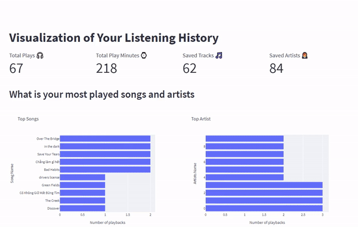

# Collecting Spotify History Data and Vizualization

## About the project

In this project, I implement a process to collect personal listening activity data using Spotify API. The data is extracted from Spotify API and loaded into a database. The stored data is then used for visualization to explore listening habits or tastes in music

## Diagrams

1. Overall process

2. ERD

## Demo

## Further Improvemments

- Setup Airflow to schedule the extract process daily
- More complex and interactive visualizations to explore deeper the listening habits and tastes in music
- Deploy on Streamlit Cloud

## References

- [Spotipy](https://spotipy.readthedocs.io/en/2.19.0/) - Python wrapper for Spotify Web API
- [Streamlit](https://streamlit.io/) - used for building web app 